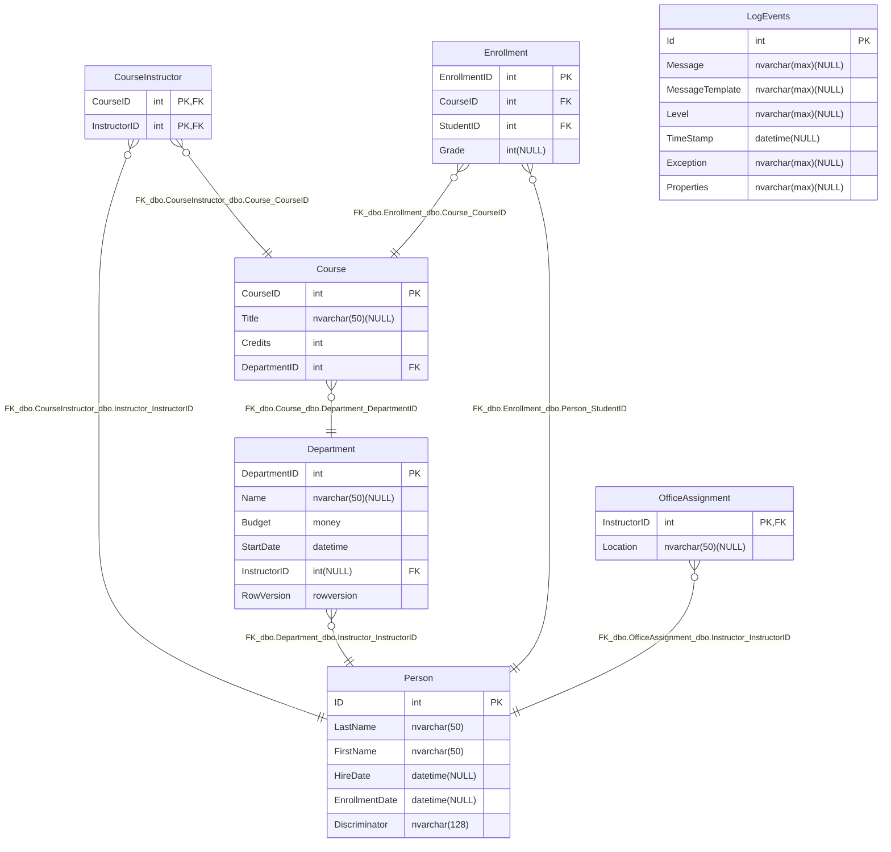

## ContosoUniversity

```mermaid
erDiagram
  Course {
    CourseID int PK
    Title nvarchar(50)(NULL) 
    Credits int 
    DepartmentID int FK
  }
  Course }o--|| Department : "FK_dbo.Course_dbo.Department_DepartmentID"
  CourseInstructor {
    CourseID int PK,FK
    InstructorID int PK,FK
  }
  CourseInstructor }o--|| Course : "FK_dbo.CourseInstructor_dbo.Course_CourseID"
  CourseInstructor }o--|| Person : "FK_dbo.CourseInstructor_dbo.Instructor_InstructorID"
  Department {
    DepartmentID int PK
    Name nvarchar(50)(NULL) 
    Budget money 
    StartDate datetime 
    InstructorID int(NULL) FK
    RowVersion rowversion 
  }
  Department }o--|| Person : "FK_dbo.Department_dbo.Instructor_InstructorID"
  Enrollment {
    EnrollmentID int PK
    CourseID int FK
    StudentID int FK
    Grade int(NULL) 
  }
  Enrollment }o--|| Course : "FK_dbo.Enrollment_dbo.Course_CourseID"
  Enrollment }o--|| Person : "FK_dbo.Enrollment_dbo.Person_StudentID"
  LogEvents {
    Id int PK
    Message nvarchar(max)(NULL) 
    MessageTemplate nvarchar(max)(NULL) 
    Level nvarchar(max)(NULL) 
    TimeStamp datetime(NULL) 
    Exception nvarchar(max)(NULL) 
    Properties nvarchar(max)(NULL) 
  }
  OfficeAssignment {
    InstructorID int PK,FK
    Location nvarchar(50)(NULL) 
  }
  OfficeAssignment }o--|| Person : "FK_dbo.OfficeAssignment_dbo.Instructor_InstructorID"
  Person {
    ID int PK
    LastName nvarchar(50) 
    FirstName nvarchar(50) 
    HireDate datetime(NULL) 
    EnrollmentDate datetime(NULL) 
    Discriminator nvarchar(128) 
  }
```
